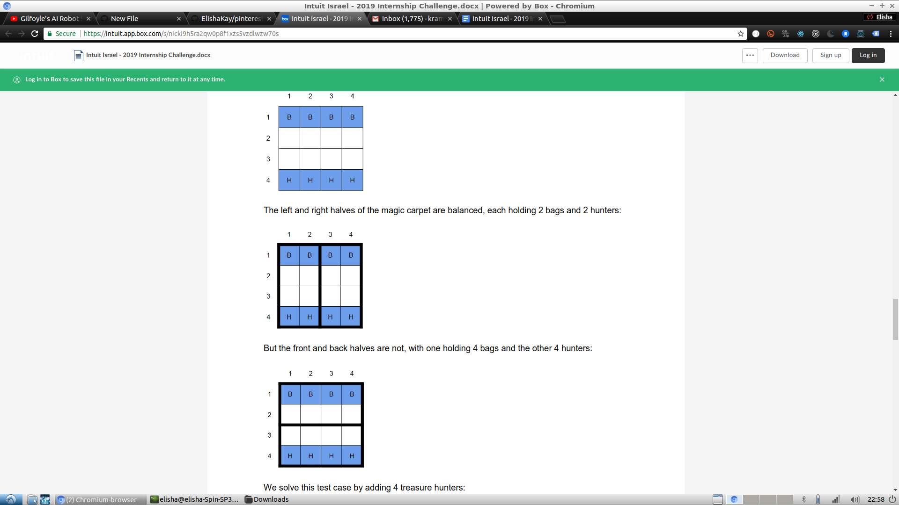
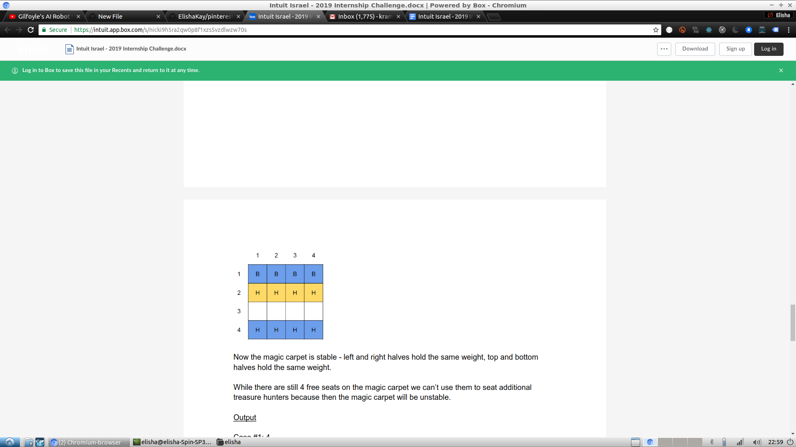
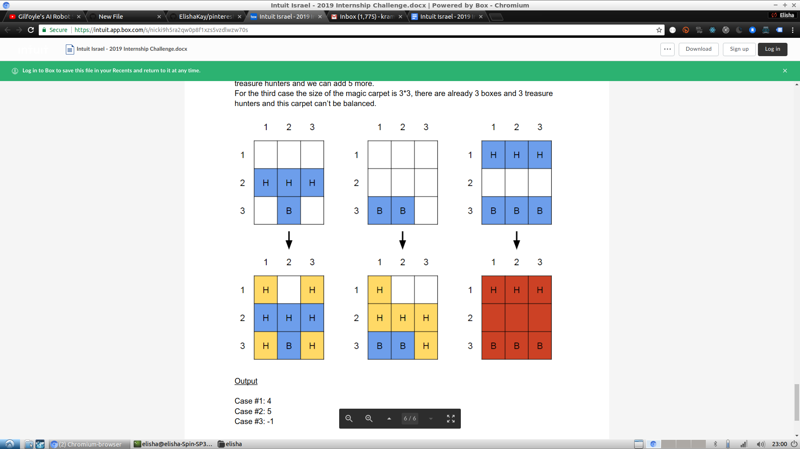

Story
 
You are a ferocious leader of an infamous gang of treasure hunters. In your latest adventure you discover a cave, filled with unimaginable riches – piles of gold and silver, precious gemstones and legendary weapons. On top of the highest pile you notice what appears as a plain looking lamp. Being the highly educated person you are, you quickly recognize the mythical story, grab the lamp and ask the genie (after being told that your wish can’t be to have more wishes, and you just wasted one) for the remaining two: a magic carpet and anti-gravity boxes (smart!) to carry all this wealth back home. After loading up all the boxes the magic carpet looks at you funny and says: “There is only one problem – neither you, nor your gang are weightless, there are going to be some serious balance and stability issues, and I’ve seen enough “Epic Fail” videos on YouTube to know how this story is going to end”.
 
Unbeknownst to your gang, for the past several years you’ve been staying up late every night and studying to become a software engineer, so.. you got this!
 
Problem
 
Given the size of the magic carpet, initial setup of boxes and already seated treasure hunters your goal is to find the maximum number of additional treasure hunters that can be seated while ensuring that in the end the magic carpet is stable.

Magic carpet is a square with N rows, N columns and a total of N*N seats.
It is considered balanced if: (a) its left and right halves carry the same weight and (b) its front and back halves carry the same weight.
All treasure hunters have the same weight.
Boxes are weightless.
Boxes can’t be moved around.
Already seated hunters can’t be moved around.
A single seat can be occupied by either a box or a hunter, not both.
Initial setup for the carpet is not guaranteed to be stable.
 

Input
 
Your input is guaranteed to be valid and you don’t need to implement input validation.
The first line of the input gives the number of test cases.
Each test case:
Starts with 1 line containing three integers - “N B H”, where N is the length and width of the magic carpet, B is the amount of already placed boxes, H is the amount of already seated treasure hunters.
Continues with B lines containing two integers - “X Y”, marking the position of the box on the magic carpet.
Ends with H lines containing two integers - “X Y”, marking the position of the hunter on the magic carpet.
 
Output
 
For each test case, output one line containing “Case #C: A”, where C is the test case number (starting from 1) and A is the maximum number of additional treasure hunters that can be seated while ensuring the magic carpet is stable. If it is not possible to balance the magic carpet, A should be set to -1.
 
Test Cases
 
There are two sets of test cases. First one is required for submission. Second one is optional and rewards additional points.

First set (download link):
Includes 200 test cases.
The length and width of the magic carpet (N) is guaranteed to be an even number between 2 and 100000.
The number of boxes (B) is guaranteed to be a number between 0 and 10000.
The number of hunters (H) is guaranteed to be a number between 0 and 10000.

Second set (download link):
Includes 100 test cases.
The length and width of the magic carpet (N) is guaranteed to be an odd number between 1 and 10.
The number of boxes (B) is guaranteed to be a number between 0 and 100.
The number of hunters (H) is guaranteed to be a number between 0 and 100.
For carpets that have an odd number of rows/columns, hunters sitting in the central row/column have their weight split equally between the two sides.

Hint: What does the size of the magic carpet in each set of test cases tells you about the algorithmic approach to the solution?
Scoring

Every correctly solved test case rewards 1 point (up to a maximum of 300 points).
Incorrectly solved test cases are not counted against you, so even if you are not sure you solved correctly for all test cases, it’s worth sending over.
No points are awarded for speed of submission. Take your time, and if needed you can revisit your submission as long as the challenge is open.
For submissions that score the same amount of points, preference will be given based on algorithmic complexity, efficiency, code style and readability.

Submissions

Once you completed writing the code that solves the problem run it on the relevant set of test cases and generate the output file. Submit your code, output file (or files) and any additionally required documentation using this form.

Example #1
 
Input
 
1
4 4 4
1 1
2 1
3 1
4 1
1 4
2 4
3 4
4 4
 
Explanation
 
There is 1 test case. The size of the magic carpet is 4*4 and there are already 4 boxes and 4 treasure hunters:
 

 
The left and right halves of the magic carpet are balanced, each holding 2 bags and 2 hunters:
 

 
But the front and back halves are not, with one holding 4 bags and the other 4 hunters:
 

 
We solve this test case by adding 4 treasure hunters:

 
Now the magic carpet is stable - left and right halves hold the same weight, top and bottom halves hold the same weight.

While there are still 4 free seats on the magic carpet we can’t use them to seat additional treasure hunters because then the magic carpet will be unstable.
 
Output
 
Case #1: 4
 
Example #2
 
Input
 
3
3 1 3
2 3
1 2
2 2
3 2
3 2 0
1 3
2 3
3 3 3
1 3
2 3
3 3
1 1
2 1
3 1
 
Explanation
 
There are 3 test cases:
For the first case the size of the magic carpet is 3*3, there are already 1 box and 3 treasure hunters and we can add 4 more.
For the second case the size of the magic carpet is 3*3, there are already 2 boxes and 0 treasure hunters and we can add 5 more.
For the third case the size of the magic carpet is 3*3, there are already 3 boxes and 3 treasure hunters and this carpet can’t be balanced.

 
 
Output
 
Case #1: 4
Case #2: 5
Case #3: -1

